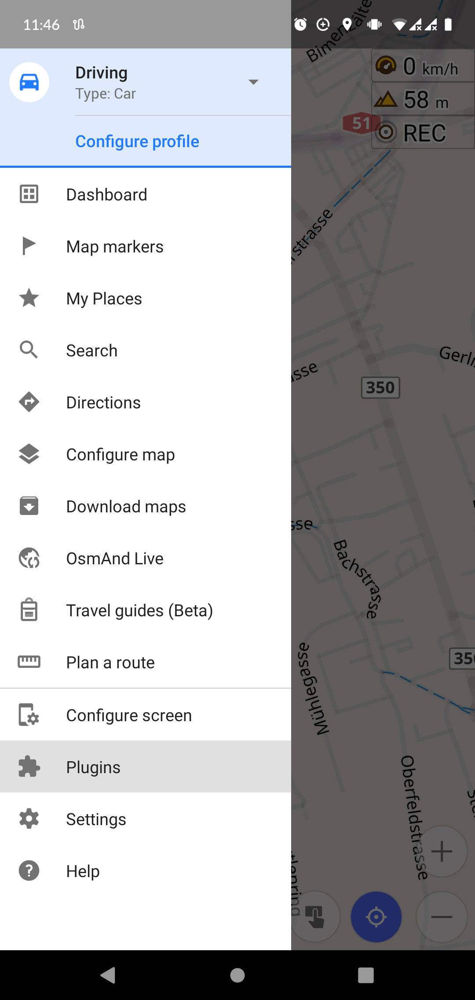
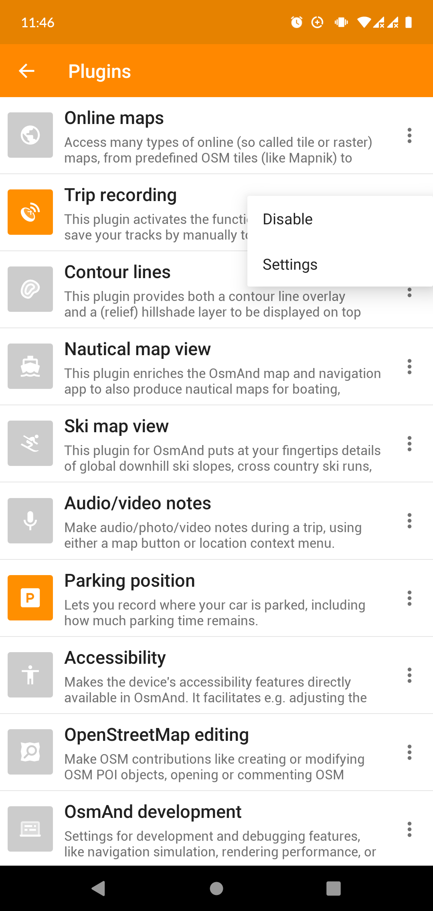
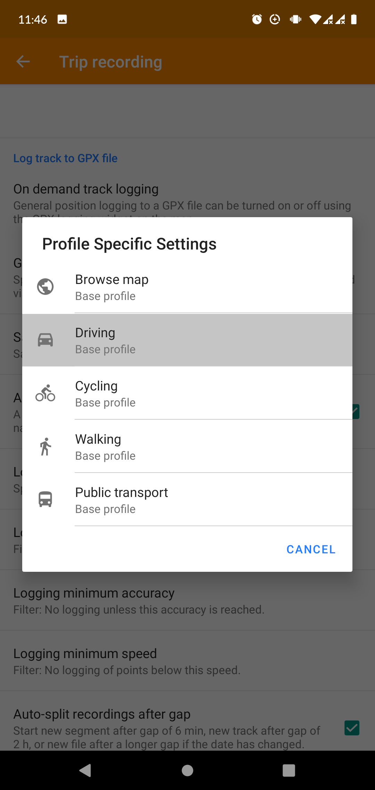
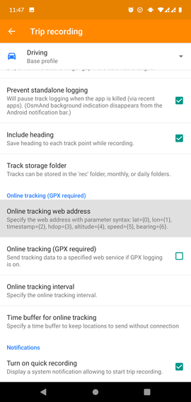
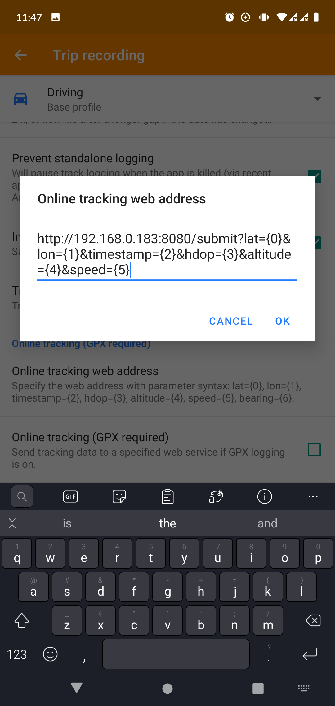
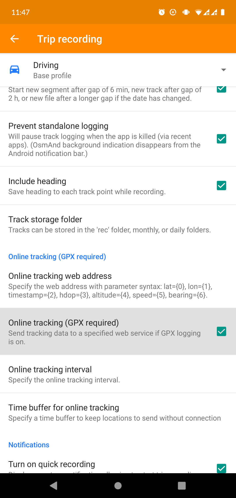
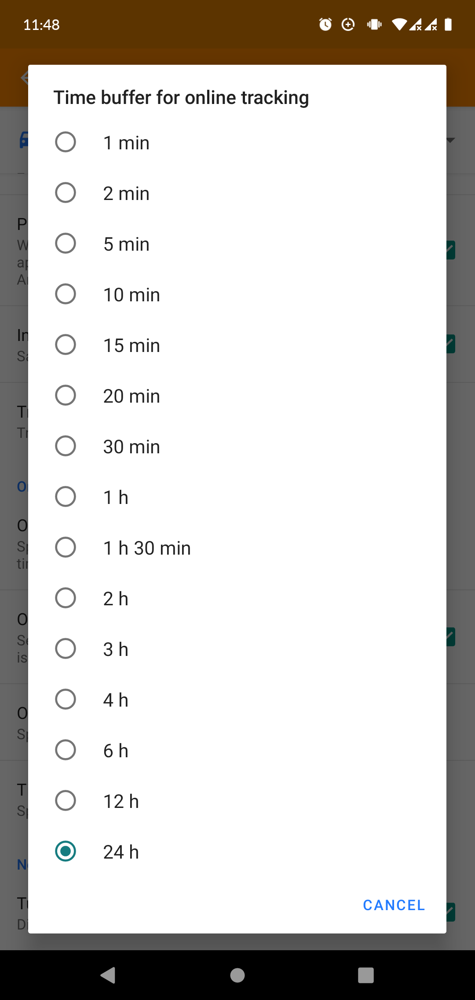
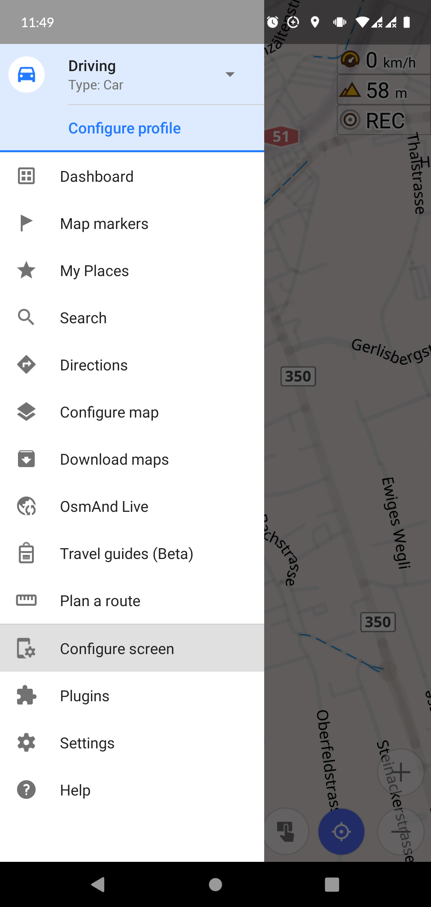
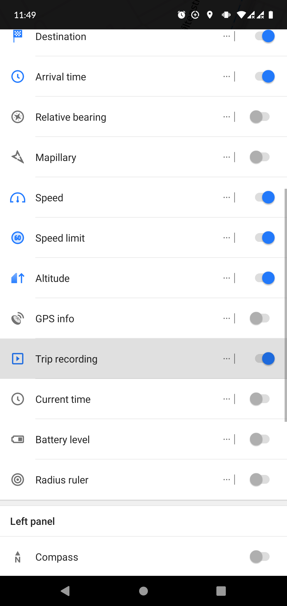
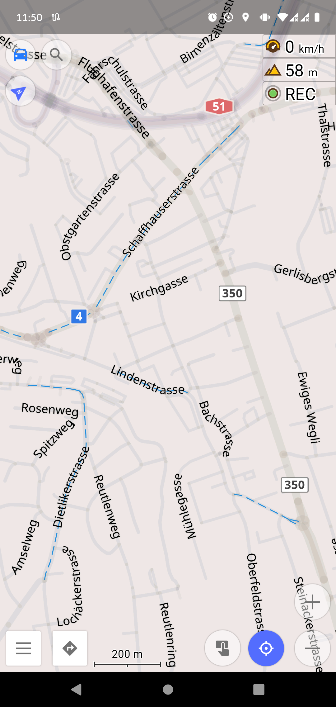

# go-osmand-tracker

A basic application written in Go for receiving live location updates from the OsmAnd app.


## Getting started

Assuming you've installed a working installation of Go, have set all required environmental variables and have set your personal preferences... Here's how to get started:

---

### 1. Running the server

**The easy way** &mdash; If you just want to download it and use it

```sh
go get github.com/ricardobalk/go-osmand-tracker
```

```sh
go-osmand-tracker
```

or...

**The hard way** &mdash; If you want to build the source code yourself and/or help with the development of this server application

**1) Clone this repository**

... via HTTPS

```sh
git clone https://github.com/ricardobalk/go-osmand-tracker.git
```

... or SSH

```sh
git clone git@github.com:ricardobalk/go-osmand-tracker.git
```

... or with the GitHub CLI

```sh
gh repo clone ricardobalk/go-osmand-tracker
```

**2) Move into the directory**

```sh
cd ./go-osmand-tracker
```

**3) Edit the source code, run or build it**

```sh
go run main.go
```

---

### 2. Setting up the OsmAnd app

**1) Open the plugin settings menu**




**2) Enable the _Trip recording_ plugin, and change the settings**






**4) Set up online tracking**

First thing to do is pointing the OsmAnd app to the `go-osmand-tracker` server. Don't forget to turn it on!







Optionally, you can tell OsmAnd to keep the location updates for a while, in case you lost internet connection.



**5) Enabling the widget for easily turning the location tracking on and off**

It is possible to enable an on-screen widget that shows up in the upper right corner, which can be tapped to switch location tracking on and off.







Alright, you're all set up! :thumbsup:

---

### 3. Using it

**Submitting location updates**

Once the server is running and receiving location updates from the OsmAnd app, the location updates appear in the console output of `go-osmand-tracker`.

Manual location updates (without using the OsmAnd app) can be made using any tool that can generate simple HTTP GET requests, for example, Postman or `curl`. 

An example of an update request in `curl` is shown below:

```sh
curl -I 'http://localhost:8080/submit?lat=48.858370&lon=2.294481&timestamp=1600000000000&hdop=1&altitude=10&speed=12.3456'
```

A successful location update does not return any data, but the HTTP response code should be `204 No Content`.

**Retrieving the last known location**

The last known location can be retrieved using the `/retrieve` endpoint. An example of retrieving the last known location with `curl` is shown below:

```sh
curl -s 'http://localhost:8080/retrieve'
```

```json
{"latitude":48.85837,"longitude":2.294481,"timestamp":1600000000000,"hdop":1,"altitude":10,"speed":12.3456}
```

---

## Known limitations

There are some known limitations that come with `go-osmand-tracker`. As a proof of concept, the things described below were not part of the initial specification. **All help is appreciated! If you're participating in Hacktoberfest, feel free to help!** :wink:

### Authentication, encryption (the lack of it)

The current server I made is just an HTTP endpoint, without authentication, practically providing no security at all. If you're planning to use it in production environments (~~you should not~~), you might want to set up an intermediate proxy with Apache or Nginx, pointing to a local instance of `go-osmand-tracker` and offering some sort of authentication and SSL (TLS) security. Adding (basic) authentication and SSL (TLS) security is planned for the future.

### Multi-user support

The app can only receive location updates from a single user. When authentication is built-in, it becomes possible to provide multi-user support as well.

### Saving tracks 

The current app only saves the last known location. There is no database that can save tracks. This is planned for the future.

### Custom port

It's currently not possible to set the port from the command line. There is a variable in the source code which can be used to change the port.

### HTTP GET

The current app uses `GET` instead of `POST`, so it is not a correct REST-y way to receive location updates, but the OsmAnd uses `GET` requests for location updates, so that's why `GET` is used. It is planned that `go-osmand-tracker` should accept both `GET` (for backward compatibility) and `POST ` (with a JSON body) in the future.

