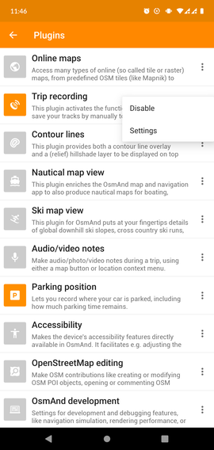
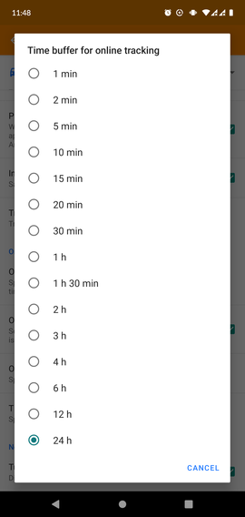
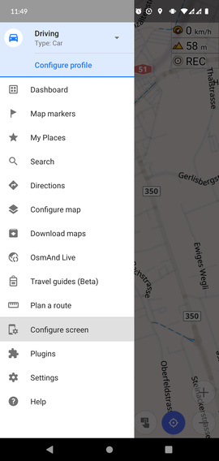

# go-osmand-tracker

A basic application written in Go for receiving live location updates from the OsmAnd app.


## Getting started

Assuming you've installed a working installation of Go, have set all required environmental variables and have set your personal preferences... Here's how to get started:

---

### 1. Running the server

**The easy way** &mdash; If you just want to download it and use it

```sh
go get github.com/ricardobalk/go-osmand-tracker
```

```sh
go-osmand-tracker
```

or...

**The hard way** &mdash; If you want to build the source code yourself and/or help with the development of this server application

**1) Clone this repository**

... via HTTPS

```sh
git clone https://github.com/ricardobalk/go-osmand-tracker.git
```

... or SSH

```sh
git clone git@github.com:ricardobalk/go-osmand-tracker.git
```

... or with the GitHub CLI

```sh
gh repo clone ricardobalk/go-osmand-tracker
```

**2) Move into the directory**

```sh
cd ./go-osmand-tracker
```

**3) Edit the source code, run or build it**

```sh
go run main.go
```

---

### 2. Setting up the OsmAnd app

**1) Open the plugin settings menu**


**2) Enable the _Trip recording_ plugin, and change the settings**




**4) Set up online tracking**

First thing to do is pointing the OsmAnd app to the `go-osmand-tracker` server. Don't forget to turn it on!


Optionally, you can tell OsmAnd to keep the location updates for a while, in case you lost internet connection.



**5) Enabling the widget for easily turning the location tracking on and off**

It is possible to enable an on-screen widget that shows up in the upper right corner, which can be tapped to switch location tracking on and off.




Alright, you're all set up! :thumbsup:

---

### 3. Using it

**Submitting location updates**

Once the server is running and receiving location updates from the OsmAnd app, the location updates appear in the console output of `go-osmand-tracker`.

Manual location updates (without using the OsmAnd app) can be made using any tool that can generate simple HTTP GET requests, for example, Postman or `curl`.

An example of an update request in `curl` is shown below:

```sh
curl -I 'http://localhost:8080/submit?lat=48.858370&lon=2.294481&timestamp=1600000000000&hdop=1&altitude=10&speed=12.3456'
```

A successful location update does not return any data, but the HTTP response code should be `204 No Content`.

**Retrieving the last known location**

The last known location can be retrieved using the `/retrieve` endpoint. An example of retrieving the last known location with `curl` is shown below:

```sh
curl -s 'http://localhost:8080/retrieve'
```

```json
{
  "latitude": 48.85837,
  "longitude": 2.294481,
  "timestamp": 1600000000000,
  "hdop": 1,
  "altitude": 10,
  "speed": 12.3456
}
```

---

## Contributing

Looking to contribute to this repository, perhaps because you're a participant of Hacktoberfest? Take a look at the [open issues][] to find things that need some work :wink: All help is appreciated! :heart:

To have an overview of who's working on what, take a look at this [kan-ban board][].

---

## License

EUPL v1.2 or later. See [LICENSE.txt](LICENSE.txt). Available in [other languages](./EUPL) as well.

[open issues]: https://github.com/ricardobalk/go-osmand-tracker/issues	"Open issues of go-osmand-tracker"
[kan-ban board]: https://github.com/ricardobalk/go-osmand-tracker/projects/1 "Who's working on what?"