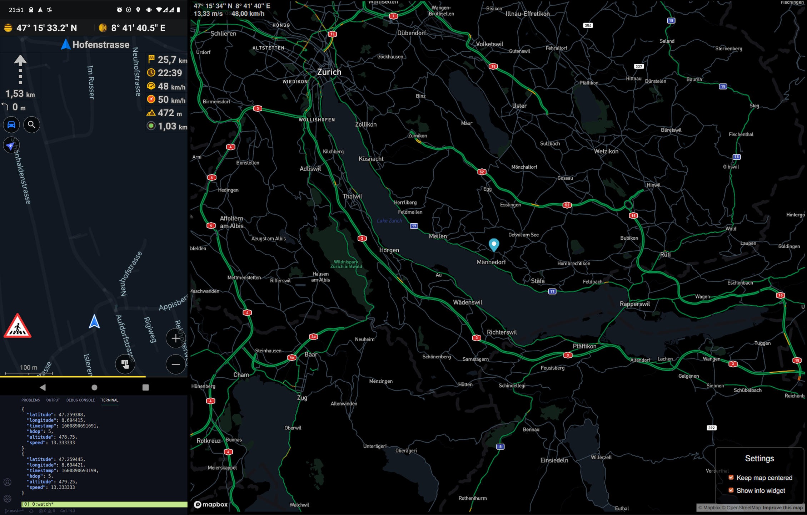

# go-osmand-tracker

A basic application written in Go for receiving live location updates from the OsmAnd app, and basically any other application that supports REST.

Image: OsmAnd app submitting location updates to the back-end, front-end retrieving the current location and showing it on a map.

---

## Go-based back-end and/or Vue-based front-end

This application consists of a back-end written in Go (REST API), and a front-end (map interface) written in modern Vue 3 with TypeScript. Because of its modular setup, it is possible to run the back-end, front-end or a combination of both.

Please read the [installation instructions](./docs/Installation) to learn how to get started.

---

## Contributing

Looking to contribute to this repository, perhaps because you're a participant of Hacktoberfest? Take a look at the [open issues][] to find things that need some work :wink: All help is appreciated! :heart:

Good to know:

- To have an overview of who's working on what, take a look at this [kan-ban board][].
- Always pull in the latest code from `develop` before working on something.
  use your Git GUI for this or use `git pull origin develop` from the command line.
- Create a new branch with a distinct name. This provides a good overview and makes reviewing code a lot easier.
  an example would be `feature/#22-dockerfile`, when you've been working on [issue #22 (Create Dockerfile)](https://github.com/ricardobalk/go-osmand-tracker/issues/22)
- The difference between an **improvement** and an **enhancement**.
  - An **improvement** is something that **currently works** but could be done in a better way. Something that needs to be **improved**. An improvement does not change the overall behaviour of the application. Like [using gin-gonic/gin instead of net/http (#17)](https://github.com/ricardobalk/go-osmand-tracker/pull/17).
  - An **enhancement** is something that doesn't yet exist, like a new feature. Something that needs to be added to the application in order to **enhance** it. An enhancement changes the behaviour of the application. Like [saving tracks to a database (#3)](https://github.com/ricardobalk/go-osmand-tracker/issues/3).
- If you have any question, feel free to open an issue and give it the label `question`.

---

## License

EUPL v1.2 or later. See [LICENSE.txt](LICENSE.txt). Available in [other languages](./EUPL) as well.

[open issues]: https://github.com/ricardobalk/go-osmand-tracker/issues "Open issues of go-osmand-tracker"
[kan-ban board]: https://github.com/ricardobalk/go-osmand-tracker/projects/1 "Who's working on what?"
