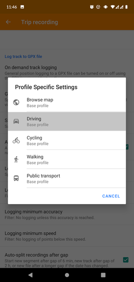
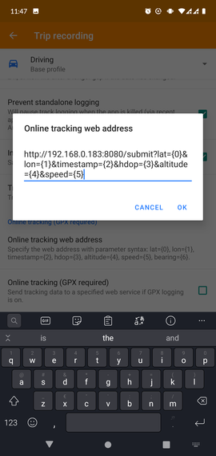

# Using it with OsmAnd

The OsmAnd app for iOS and Android has a built-in location tracking functionality. This functionality can be enabled and could be used with this location tracker.

**1) Open the plugin settings menu**

**2) Enable the _Trip recording_ plugin, and change the settings**

**4) Set up online tracking**

First thing to do is pointing the OsmAnd app to the `go-osmand-tracker` server. Don't forget to turn it on!

Optionally, you can tell OsmAnd to keep the location updates for a while, in case you lost internet connection.

**5) Enabling the widget for easily turning the location tracking on and off**

It is possible to enable an on-screen widget that shows up in the upper right corner, which can be tapped to switch location tracking on and off.

Alright, you're all set up! :thumbsup: